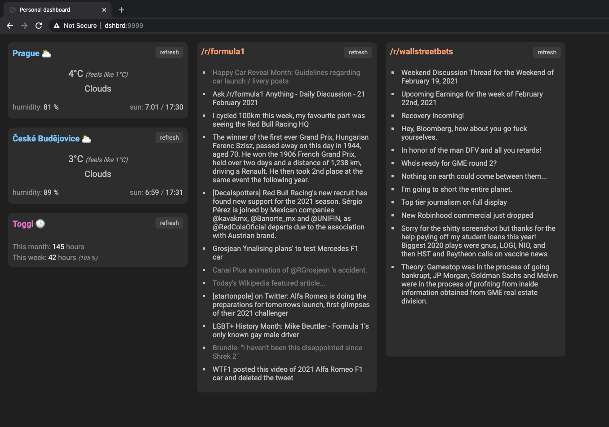

# My personal dashboard

I wanted to learn typescript, React hooks and how to use VSCode.

## Prerequisities

You need to update your `/etc/hosts`, so that `dshbrd` points to your `localhost`.

## Running

First, you need to run the server.

```bash
cd server && yarn install && TOGGL_TOKEN=<your-token> yarn start
```

The server is now running on port `http://dshbrd:9998`.

---

Now it's time to start the client.

```bash
cd client && yarn install && OPEN_WEATHER_TOKEN=<your-token> yarn start --port 9999
```

The client is running on `http://dshbrd:9999`.

You should see something like this:



## Resources

- [Toggl API](https://github.com/toggl/toggl_api_docs)
- [OpenWeather API](https://openweathermap.org/api)
